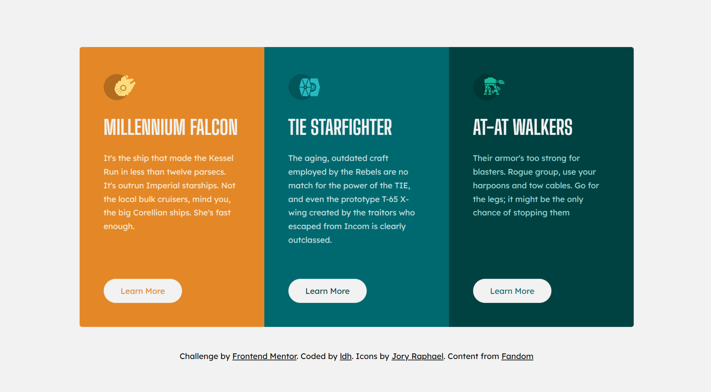

# Frontend Mentor - 3-column preview card component solution

This is a solution to the [3-column preview card component challenge on Frontend Mentor](https://www.frontendmentor.io/challenges/3column-preview-card-component-pH92eAR2-). Frontend Mentor challenges help you improve your coding skills by building realistic projects.

## Table of contents

- [Overview](#overview)
  - [The challenge](#the-challenge)
  - [Screenshot](#screenshot)
  - [Links](#links)
- [My process](#my-process)
  - [Built with](#built-with)
  - [Continued development](#continued-development)
  - [Useful resources](#useful-resources)
- [Author](#author)
- [Acknowledgments](#acknowledgments)

## Overview

### The challenge

Users should be able to:

- View the optimal layout depending on their device's screen size
- See hover and focus states for interactive elements

### Screenshot

### Links

- Solution URL: [solution URL](https://github.com/LukeDHarrison/starwars-cards-frontend-mentor-solution)
- Live Site URL: [live site URL](https://starwars-cards-frontend-mentor-solution.netlify.app/)

## My process

### Built with

- Semantic HTML5 markup
- CSS custom properties
- Flexbox
- CSS Grid
- CSS Variables

### Continued development

The card button text colour changes on hover to match the cards background. This has resulted in some verbose CSS. I am sure there is a better way to achieve this with some fancy modern CSS selectors

### Useful resources

SVG icons sourced from the talented Jory Raphael
. [Check out his Dribbble here!](https://dribbble.com/shots/1400124-More-Free-Star-Wars-Icons)

Card content is from Star Wars Fandom.
. [Check out the wesbite here!](https://starwars.fandom.com/wiki/Main_Page)

## Author

- Website - [Luke D Harrison](https://www.your-site.com)
- Frontend Mentor - [@LukeDHarrison](https://www.frontendmentor.io/profile/LukeDHarrison)
- Twitter - [@LukeDHarrison\_](https://twitter.com/LukeDHarrison_)
